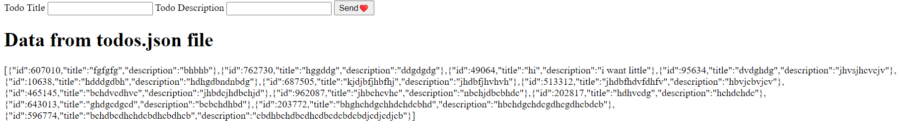

I have created two folder 1.frontend 2.backend for simplicity

Few Instruction to follows
==> First go to the backend folder and run _todoServer.solution.file.js_
before running that js file do _npm init_ so that all dependencies get installed
i have used the same name for file as harkirat did to ignore confusion

==> Second go the frontend folder and run index.html using live server extension
i have added few codes in frontend file to display data from _todos.json_ file which is in backend folder

Happy Coding !!
